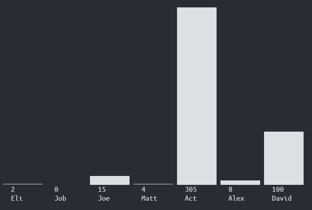

# BarPlot
Plot bar chart with a single bash script, no any other dependencies. Handy, easy, even though a little bit dirty 😉

## Usage

```bash
    ./plot.sh 10    # 10 is the scalar, could be any number
```



---

> This idea was originated by:
> - https://stackoverflow.com/questions/30929012/shell-how-can-i-make-a-text-mode-bar-chart-from-parsed-data-numbers

